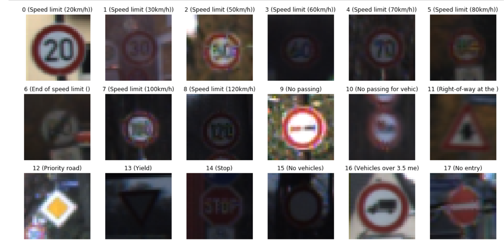
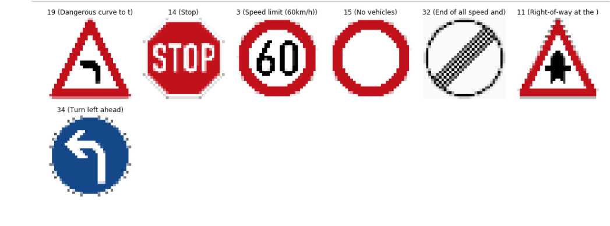
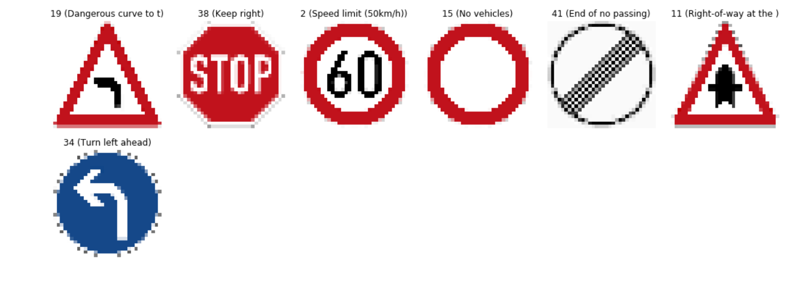
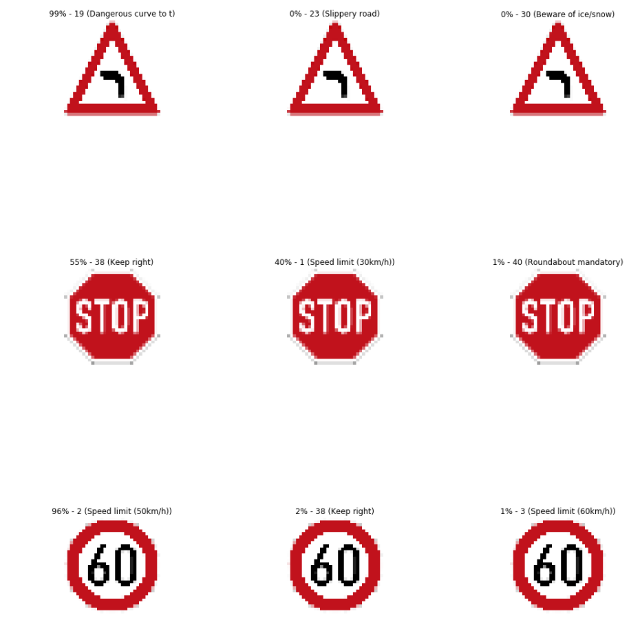
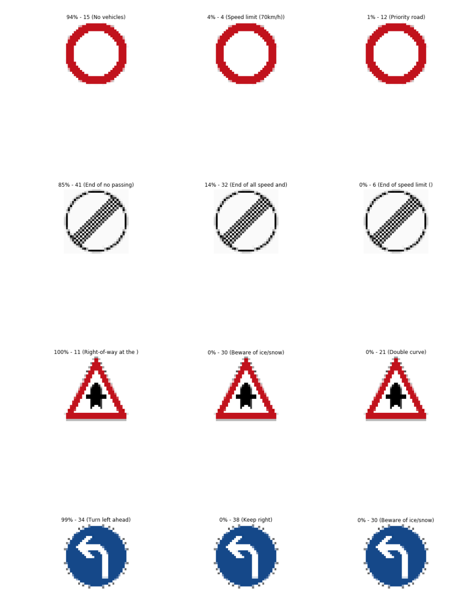

# **Traffic Sign Recognition** 

## Writeup

---

**Build a Traffic Sign Recognition Project**

The goals / steps of this project are the following:
* Load the data set (see below for links to the project data set)
* Explore, summarize and visualize the data set
* Design, train and test a model architecture
* Use the model to make predictions on new images
* Analyze the softmax probabilities of the new images
* Summarize the results with a written report

[//]: # (Image References)

[image1]: ./examples/visualization.jpg "Visualization"
[image2]: ./examples/grayscale.jpg "Grayscaling"
[image3]: ./examples/random_noise.jpg "Random Noise"
[image4]: ./examples/placeholder.png "Traffic Sign 1"
[image5]: ./examples/placeholder.png "Traffic Sign 2"
[image6]: ./examples/placeholder.png "Traffic Sign 3"
[image7]: ./examples/placeholder.png "Traffic Sign 4"
[image8]: ./examples/placeholder.png "Traffic Sign 5"

## Rubric Points
### Here I will consider the [rubric points](https://review.udacity.com/#!/rubrics/481/view) individually and describe how I addressed each point in my implementation.  

---

### Data Set Summary & Exploration

#### 1. Provide a basic summary of the data set. In the code, the analysis should be done using python, numpy and/or pandas methods rather than hardcoding results manually.

I used the pandas library to calculate summary statistics of the traffic
signs data set:

* The size of training set is 34799
* The size of the validation set is 4410
* The size of test set is 12630
* The shape of a traffic sign image is 32x32 with 3 channels
* The number of unique classes/labels in the data set is 43

#### 2. Include an exploratory visualization of the dataset.

Here is an exploratory visualization of the data set. It is a bar chart showing how the data ...

### Design and Test a Model Architecture

#### 1. Describe how you preprocessed the image data. What techniques were chosen and why did you choose these techniques? Consider including images showing the output of each preprocessing technique. Pre-processing refers to techniques such as converting to grayscale, normalization, etc. (OPTIONAL: As described in the "Stand Out Suggestions" part of the rubric, if you generated additional data for training, describe why you decided to generate additional data, how you generated the data, and provide example images of the additional data. Then describe the characteristics of the augmented training set like number of images in the set, number of images for each class, etc.)

The only image pre-processing steps that I did were to

- convert the images to grayscale 
- normalize the pixels to be between 0 and 1

The first steps allowes for a simpler, more efficient CNN and works because the colors used in traffic signs rarely are he main defining factor
The second steps allows for faster training conversison

I did not try to augment the data because the network worked well right away to provide high accuracy on the test set.
If I were to augment the data I would add several orientaions of the same sign image

#### 2. Describe what your final model architecture looks like including model type, layers, layer sizes, connectivity, etc.) Consider including a diagram and/or table describing the final model.

My final model consisted of the following layers:

	Conv Layer 1:  Input = 32x32x1. Output = 28x28x6.
		 				 5x5 filter with stride 1, VALID padding
		  				Activation: RELU

	Pooling Layer. Input = 28x28x6. Output = 14x14x6.

	Conv Layer 2:  Input = 14x14x6. Output = 10x10x16.
		  			       5x5 filter with stride 1, VALID padding
		  				Activation: RELU

	Pooling Layer. Input = 10x10x16. Output = 5x5x16.
						Flattened to 400 nodes
						Dropout (keep_prob = 0.8)

	Fully connected Layer 3:  Input = 400. Output = 120.
						Activation: RELU
						Dropout (keep_prob = 0.8)

	Fully connected Layer 4:  Input = 120. Output = 84.
						Activation: RELU
						Dropout (keep_prob = 0.8)

	Fully connected Layer 5:  Input = 84. Output = 43.
						SOFTMAX
       					
       					

#### 3. Describe how you trained your model. The discussion can include the type of optimizer, the batch size, number of epochs and any hyperparameters such as learning rate.

To train the model I used the batch size of 128 and the number of EPOCHs was set to 30. This model is essentailly the  same as was given to us in class with the  addition of the Droput on the fully connected layers.

#### 4. Describe the approach taken for finding a solution and getting the validation set accuracy to be at least 0.93. Include in the discussion the results on the training, validation and test sets and where in the code these were calculated. Your approach may have been an iterative process, in which case, outline the steps you took to get to the final solution and why you chose those steps. Perhaps your solution involved an already well known implementation or architecture. In this case, discuss why you think the architecture is suitable for the current problem.

Notably, without the dropout layers the trainig was not successful at all but as soon as the dropout layers were added the small number of 30 epochs was enough.
Honestly with the dropout layers the performance was great right away and I only needed to play with the learning rate and the keep probability.
I setteled on the learning rate of 0.0005 and the keep proability of 80%. After 30 EPOCHS

After only 30 EPOCHs we had

Training Accuracy = 0.996

Validation Accuracy = 0.953

Test Accuracy = 0.0.933

I run 45 EPOCHs once and I saw that the results have improved but kept the  number at 30 to save GPU time

With 30 EPOCHs I saw  the validation accuracy was still growing. Usually it is a good idea to do an early stop when the validation accuracy stops improving.

### Test a Model on New Images

#### 1. Choose five German traffic signs found on the web and provide them in the report. For each image, discuss what quality or qualities might be difficult to classify.

Here are seven  German traffic signs that I found on the web.
I had to preprocess them to be of size 32x32. Possibly the techique I have chosen to do this transformation resulted in sub-par performance of the network on these particular signs.

#### 2. Discuss the model's predictions on these new traffic signs and compare the results to predicting on the test set. At a minimum, discuss what the predictions were, the accuracy on these new predictions, and compare the accuracy to the accuracy on the test set (OPTIONAL: Discuss the results in more detail as described in the "Stand Out Suggestions" part of the rubric).

Here are the results of the prediction:

Only 57% accuracy (4 out of 7).

However the good news was that  the correct caption was always present in the top 3 model predictions for each of the signs:

